<h1 style="text-align: center;">Actividad1-CC3S2</h1>
<h2>1. Lectura y reflexión:</h2>

<li> <b>¿Qué es DevOps?</b></li>

El termino DevOps es una combinación de las palabras development (desarrollo) y operations (operaciones),  es un cambio de cultura y la unión de personas, procesos y herramientas que trata de alinear prioridades, flujos de trabajo y eliminar silos que obstaculicen la comunicación y el progreso efectivo para proporcionar continuamente valor a los usuarios finales.

<li><b>Historia y antecedentes de DevOps</b></li>

Antes de la aparición de DevOps los desarrolladores trataban de aplastar los errores de software antes de su lanzamiento al usurio final preocupandose poco por la estabilidad del software, esto cambio con la aparición del servidor HTTP de Apache y el cambio hacia la comunicación de red surgio la necesidad de que las operaciones de IT gestionaran este nuevo paradigma.

<li><b>Diferencias entre los equipos de desarrolloy operaciones en el pasado.</b></li>

EL equipo de desarrollo busca agregar caracteristicas, esto de hacerse de manera correcta y eficiente perjudicaria la estabilidad del sistema.
EL quipo de operaciones de IT considera que la estabilidad del sistema era su maxima prioridad.

<li><b>Principios fundamentales de DevOps (centrado en el cliente, equipos autónomos y multifuncionales, mejora continua, automatización).</b></li>

<b>- Centrado en el cliente:</b> Ofrecer productos rapidos, vanguardistas y confiables, resolviendo problemas del mundo real de manera eficiente.

<b>- Centrado en equipos autónomos y multifuncionales:</b> Devops no solo busca la formación de equipos diversos, sino que estos equipos sean autonomos, capaces de supervisar un producto o caracteristica desde su concepción hasta su entrega esto porque si un equipo posee un conjunto de habilidades la velocidad de toma de decisiones se acelera y elimina la cadena de mando lenta y engorrosa.

<b>- Centrado en la mejora continua:</b> Permite la confiabilidad, adaptibilidad y eficiencia de los procesos de entrega de software, contribuye a la optimización de recursos y entrega más rapida de características, su importancia se ve mas clara en los <b>ciclos de retroalimentación</b> el cual permite el monitoreo en tiempo real del sistema.

<li><b>Qué NO es DevOps</b></li>

1. DevOps no es una herramienta, tecnologia o producto.

2. DevOps no se trata de individuos especificos, equipos o roles.

3. DevOps no solo es un proceso

<h2>2. Preguntas de reflexión:</h2>
<li><b>¿Por qué surgió la necesidad de DevOps en el desarrollo de software?</b></li>

Devops surge como necesidad de desarrollar más rapido productos de software, lo que hacia más lento al desarrollo de software eran o siguen siendo los silos esto es basicamente grupos dentro del desarrollo de software que carecen de integración o comunicación con otras partes lo que lleva a retrasos o ineficiencias.

<li><b>Explica cómo la falta de comunicación y coordinación entre los equipos de desarrollo y operaciones en el pasado ha llevado a la creación de DevOps.</b></li>

En el pasado los equipos que trabajaban en e desarrollo de software trabajaban de manera aislada (silos) con muy poca integración en en producto final del software lo que llevaba a retrasos y ineficiencias, por esto y ademas con la aparición del server HTTP de Apache y con una comunicacíon orientada en la red se llevo a desarrollar una cultura de desarrollo de software que hoy llamamos como DevOps.

<li><b>Describe cómo el principio de mejora continua afeca tanto a los aspectos técnicos como culturales de una organización.</b></li>

<b>-En aspectos tecnicos:</b> Permite cualidades como la confiabilidad, adaptabilidad y eficiencia de los procesos de entrega de software a través de un aalisis continuo de métricas y la utlización de flujos de trabajo automatizados.

<b>-En una organización:</b> Fomenta un entorno colaborativo, asegurando responsabilidad, alienta una cultura de aprendizaje y, en última instancia, ayudando a desmantelar silos organizacionales.

<li><b>¿Qué significa que DevOps no se trata solo de herramientas, individuos o procesos?</b></li>

No. DevOps representa un cambio cultural y un enfoque diseñado para eliminar la fricción entre los silos dentro de una organización, eso implica un cambio en la mentalidad, los habitos y la cultura.

<li><b>Según el texto, ¿cómo contribuyen los equipos autónomos y multifuncionales a una implementación exitosa de DevOps?</b></li>

Al desarrollar equipos autonomos que poseen diferentes caracteristicas y poseer toma de deciciones de manera autonoma elimina la cadena de mando lenta y engorrosa, esto cultiva una cultura de propiedad y responsabilidad. Los equipos autonomos y multifuncionales liminan silos por esto resulta ser una piedra angular en el desarrollo de una cultura DevOps

<h2>1. Configuración del entorno</h2>
<h3>- Proyecto: Utilizaremos una aplicación web sencilla utilizando Node.js. Esta aplicación tendrá una API REST básica con un único endpoint que devuelve un mensaje de  "<b>Hello, World!</b>"</h3>

<b>1. Inicializa el proyecto de Node.js:</b>

En el escritorio crearemos la carpeta <b>devops-practice</b> en el cual inicializaremos el proyecto Node.js con <b>npm init -y.</b> 

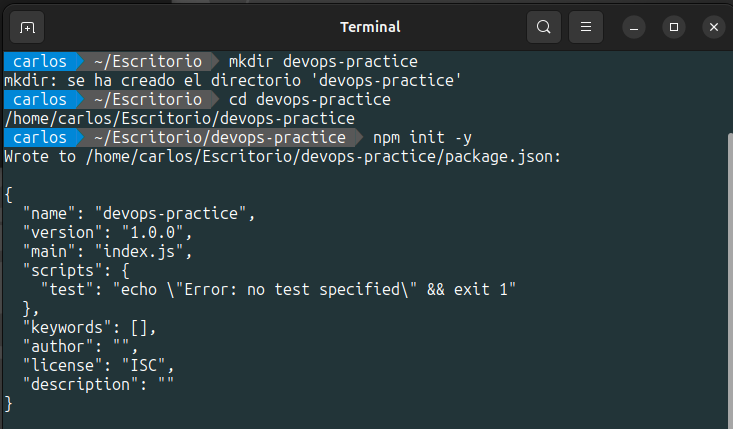

<b>2. Instala las dependencias necesarias:</b>

Instalaremos el Framework Express para el manejo de peticiones HTTP y Jest es un paquete NPM para crear, ejecutar y estructurar pruebas.

<b>3. Crea la estructura del proyecto:</b>

Crearemos la carpeta <b>src y tests</b> en el cual crearemos los scripts vacios <b>app.js y app.test.js</b> respectivamente.

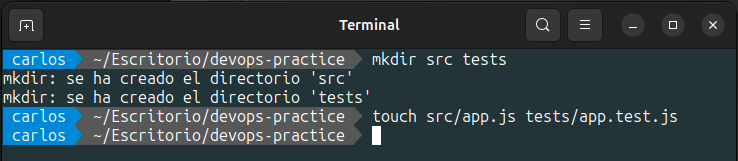

<b>4. Implementa la API REST en src/app.js:</b>

El script <b>app.js</b> solo contendra laconfiguración de la aplicación y funcionara de la siguiente manera: Se importa el modulo Express para inicializar una nueva aplicación Express, esta aplicación se le asigna a la constante <b>app</b>. Se define la ruta GET en la raíz ('/'), cuando se acceda a esta ruta raíz esta nos dará la respuesta <b>Hello, World!</b>. Se exporta la aplicación <b>app</b> para que pueda ser utilizada por otros módulos.

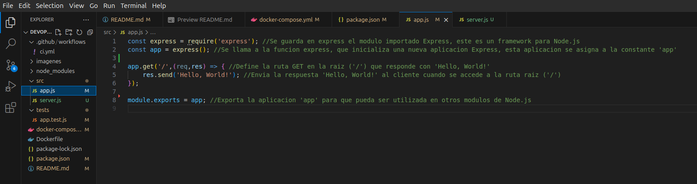

Se creara el script <b>server.js</b> el cual tendra la logia del inicio del servidor asi como el puerto que sera utlizado para escuchar las solicitudes de los clientes.

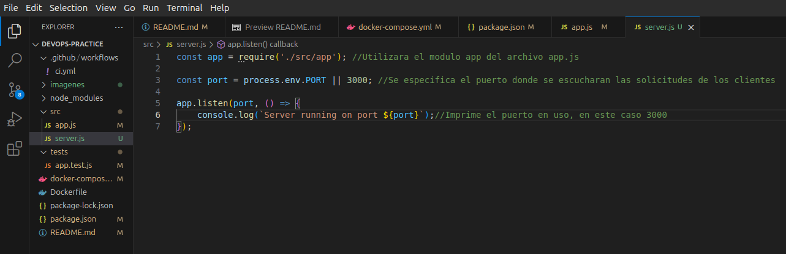

<b>5. Escribe un test básico en tests/app.test.js</b>

El script app.test.js funcionara de la siguiente manera: Se importa la librería <b>supertest</b>, esta es una librería para realizar pruebas en aplicaciones web. Se importa <b>Express</b> desde <b>app.js</b>. Se hará uso de un servidor Express el cual se iniciara al ejecutar las pruebas y terminara al finalizar las pruebas, este servidor se ejecutara en un puerto dinámico, en <b>describe</b> se define el conjunto de pruebas para la ruta <b>'GET /'</b>. En <b>it</b> se define el test, el primer argumento de <b>it</b> es lo que debería hacer el código, el segundo argumento es la lógica de la prueba asincronía, <b>resquest(app).get('/')</b> usa <b>supertest</b> para hacer una solicitud <b>HTTP GET</b>  a la ruta <b>`/`</b>. Usamos <b>expect(res.statusCode).toEqual(200)</b> para verificar que la respuesta tenga un código de estado <b>200</b>, lo que indica que la solicitud fue exitosa seguidamente usamos <b>expect(res.text).toBe('Hello, World!')</b> para verificar que la aplicación responda correctamente a la solicitud del cliente.

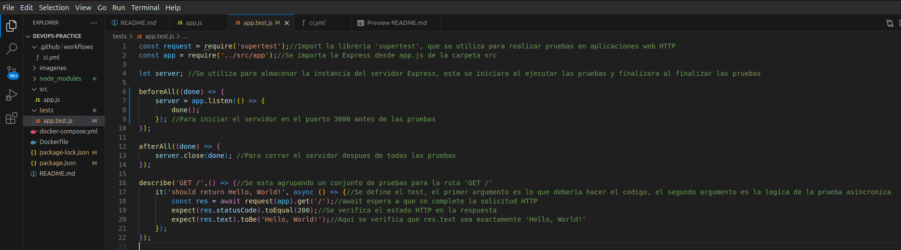

<b>6. Configura el script de test en package.json</b>

En <b>package.json</b> gestionaremos la configuración de nuestro proyecto, al cual se aginaremos en nombre de <b>devops-practice</b> con una version de <b>1.0.0</b>, también utilizaremos el script npm <b>jet</b>, como dependencia utilizaremos el framework <b>Express</b>, en <b>devDependencies</b> utilizaremos la version <b>27.0.0</b> de <b>jest</b> y la version <b>6.1.3</b> de <b>supertest</b>.

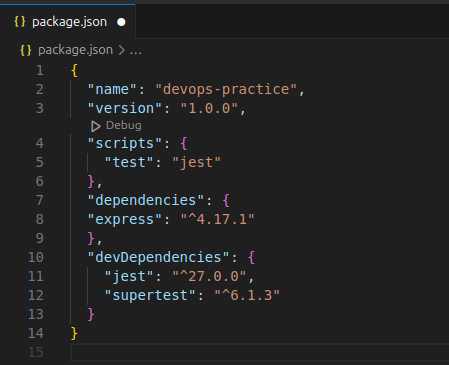

<h2>2. Pipeline CI/CD</h2>

<h3>Parte 1: Configura integración continua (CI) con GitHub Actions</h3>
<h3>- Crea un archivo de configuración para GitHub Actions:</h3>

<b>1. Crea la estructura para GitHub Actions:</b>

Crearemos el directorio <b>.github/workflows</b> donde ira el archivo de configuración de <b>GitHub Actions</b>, este archivo define el flujo de trabajo de <b>CI/CD</b> y se ejecutarán en respuesta a eventos en el repositorio.

<b>2. Define el flujo de trabajo en .github/workflows/ci.yml:</b>

El proceso descrito a continuación detalla cómo se configura y ejecuta un pipeline en un entorno de integración continua (CI). Este pipeline se activa cada vez que se realiza un push o pull request en la rama principal (main) del repositorio, lo que facilita la comunicación y sincronización entre los procesos de desarrollo.

El funcionamiento del pipeline se define en la sección <b>jobs</b>, que especifica el conjunto de pasos que se ejecutarán como parte del <b>workflow</b>. El primer <b>job</b> se denomina <b>build</b>, y en él utilizaremos <b>runs-on</b> para definir dónde se ejecutará el <b>workflow</b>. En este caso, se ejecutará en una máquina virtual con la última versión disponible de Ubuntu, especificada como <b>ubuntu-latest</b>.

A continuación, en la sección <b>steps</b>, se definen las acciones o comandos específicos que se ejecutarán dentro del job <b>build</b>. El primer paso es usar <b>actions/checkout@v2</b> para clonar el repositorio en la máquina virtual. El segundo paso, denominado <b>"Set up Node.js"</b>, emplea la acción <b>actions/setup-node@v2</b> para instalar la versión 20 de <b>Node.js</b> en la máquina virtual.

El tercer paso, llamado <b>"Install dependencies"</b>, ejecuta el comando <b>npm install</b> para instalar las dependencias necesarias, tal como se definen en <b>package.json</b>. El cuarto paso, <b>"Run tests"</b>, utiliza el comando <b>npx jest --verbose</b> para realizar las pruebas.

<h3>Parte 2: Configura entrega continua (CD) con Docker</h3>
<h3>- Crea un archivo Docker para contenerizar la aplicación:</h3>

<b>1. Crea un archivo Dockerfile</b>:

En el archivo <b>Dockerfile</b>, comenzamos especificando la imagen base con <b>FROM node:20</b>, lo que indica que utilizaremos la imagen oficial de <b>Node.js</b> en su <b>versión 20</b>. A continuación, establecemos el directorio de trabajo en el contenedor utilizando <b>WORKDIR /app</b>.

Luego, copiamos los archivos <b>package.json</b> y <b>package-lock.json</b> al contenedor con el comando <b>COPY package*.json ./</b> . Para instalar las dependencias necesarias, ejecutamos <b>RUN npm install</b>.

Seguidamente, copiamos el resto de los archivos de la aplicación al contenedor con <b>COPY . .</b>. Posteriormente, exponemos el puerto en el que la aplicación se ejecutará utilizando <b>EXPOSE 3000</b>.

Finalmente, iniciamos la aplicación con el comando <b>CMD ["node", "src/app.js"]</b>.

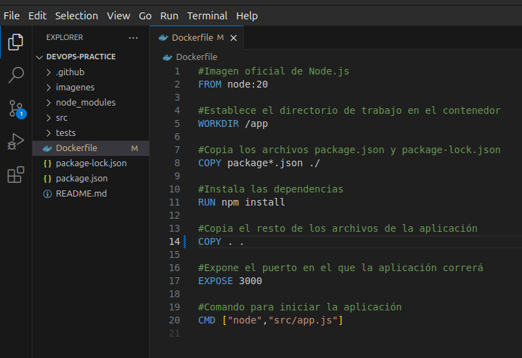

<b>2. Construye la imagen de Docker:</b>

Utilizaremos el comando <b>docker build -t devops-practice . para construir la imagen Docker</b>.

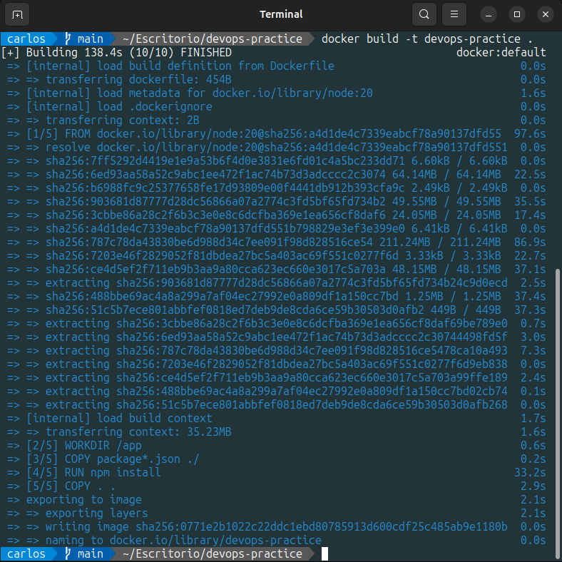

<b>3. Corre el contenedor localmente:</b>

Utilizaremos el comando <b>docker run -p 3000:3000 devops-practice</b> para correr el contenedor Docker localmente en el puerto <b>3000</b>.

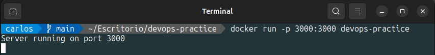

<h3>- Automatiza el despliegue con GitHub Actions:</h3>

<b>1. Actualiza el archivo .github/workflows/ci.yml para construir y desplegar la imagen de Docker:</b>

convierte en la entrada del siguiente. Esto facilita la comunicación y sincronización entre los procesos. El archivo <b>ci.yml</b> se ejecutará cada vez que haya un <b>push</b> o <b>pull request</b> en la rama <b>main</b>.

El funcionamiento del pipeline se define en la sección <b>jobs</b>, que especifica el conjunto de pasos que se ejecutarán como parte del <b>workflow</b>. El primer <b>job</b> se denomina <b>build</b>, y en él utilizaremos <b>runs-on</b> para definir dónde se ejecutará el <b>workflow</b>. En este caso, se ejecutará en una máquina virtual con la última versión disponible de Ubuntu, especificada como <b>ubuntu-latest</b>.

A continuación, en la sección <b>steps</b>, se definen las acciones o comandos específicos que se ejecutarán dentro del job <b>build</b>. El primer paso es usar <b>actions/checkout@v2</b> para clonar el repositorio en la máquina virtual. El segundo paso, denominado <b>"Set up Node.js"</b>, emplea la acción <b>actions/setup-node@v2</b> para instalar la versión 20 de <b>Node.js</b> en la máquina virtual.

El tercer paso, llamado <b>"Install dependencies"</b>, ejecuta el comando <b>npm install</b> para instalar las dependencias necesarias, tal como se definen en <b>package.json</b>. El cuarto paso, <b>"Run tests"</b>, utiliza el comando <b>npx jest --verbose</b> para realizar las pruebas.

En el quinto paso, <b>"Build Docker image"</b>, se emplea el comando <b>docker build -t devops-practice</b> para construir la imagen Docker. Finalmente, el último paso, <b>"Run Docker container"</b>, utiliza el comando <b>docker run -d -p 3000:3000 devops-practice</b> para ejecutar el contenedor Docker en segundo plano, mapeando el puerto 3000 del contenedor al puerto 3000 de la máquina virtual.

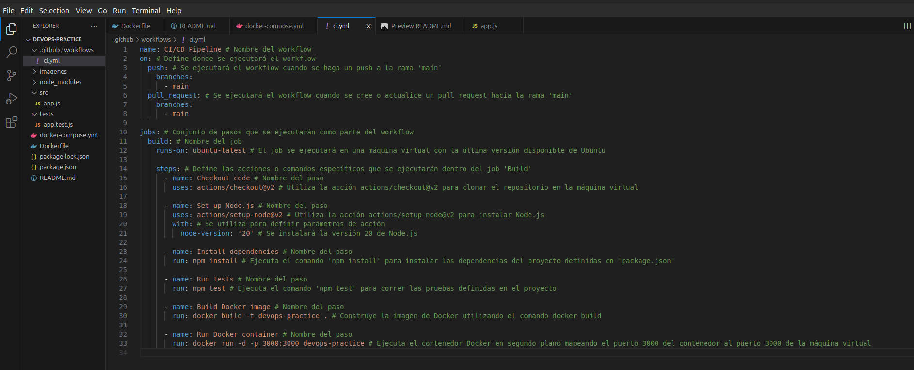

<b>2. Verifica que la aplicación se despliegue correctamente localmente usando Docker:</b>

Utilizamos <b>localhost:300</b> en nuestro navegador para verificar si la aplicacion se ha desplegado correctamente.

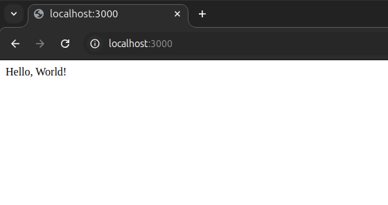

<h2>3. Automatización</h2>
<h3>- Automatiza la configuración y gestión del entorno local usando Docker Compose:</h3>

<b>1. Crea un archivo docker-compose.yml:</b>

Creamos el archivo <b>docker-compose.yml</b>, una herramienta de Docker que permite definir y gestionar aplicaciones compuestas por múltiples contenedores de manera declarativa. Este archivo especifica cómo se deben configurar y ejecutar los diferentes servicios de la aplicación, así como sus volúmenes, redes y otros parámetros.

En nuestro archivo <b>docker-compose.yml</b>, se construirá una imagen utilizando el Dockerfile en el directorio actual. Además, definimos cómo los puertos del contenedor se mapearán a los puertos del host, permitiendo la comunicación entre el contenedor y el exterior. También se establecen las variables de entorno que se pasarán al contenedor al momento de su ejecución, como la configuración de <b>NODE_ENV</b> en modo producción.

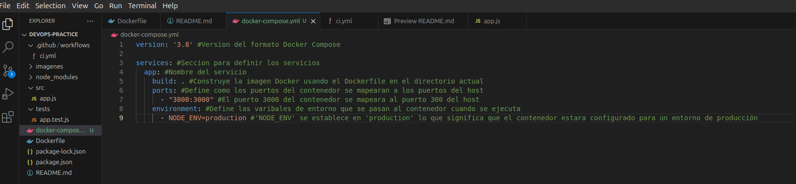

<b>2. Corre la aplicación usando Docker Compose:</b>

Utilizamos el comando <b>docker-compose up --build -d</b> para correr la aplicación utilizando Docker Compose.

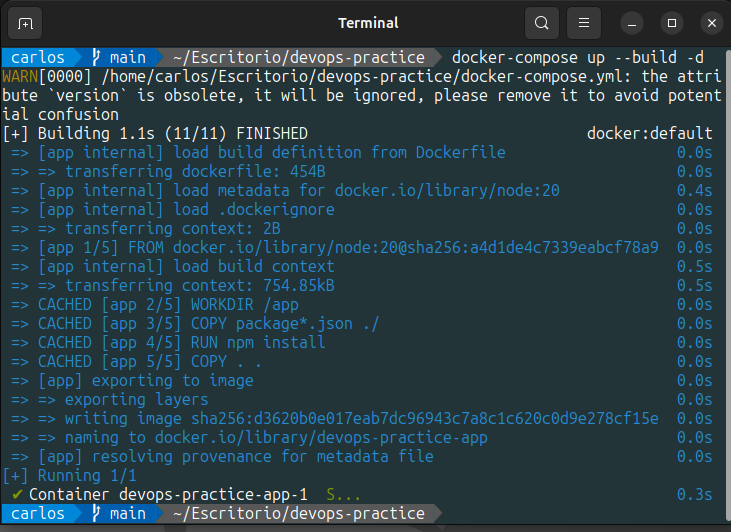

<h2>4. Evaluación</h2>
<h3>- Evaluación de la experiencia:</h3>

El uso de un Pipeline automatiza las tareas de compilación, pruebas y despliegue. Al usar Pipeline se puede controlar los procesos de ejecución de las aplicación de software esto ayuda a reducir o evitar las discrepancias entre los equipos de desarrollo y operaciones, también se pueden controlar las pruebas como el tiempo en que estos se ejecutarán, al usar Pipeline se puede controlar cada parte del proceso haciendo esto que sea una herramienta muy util para los equipos de desarrollo y operaciones.

