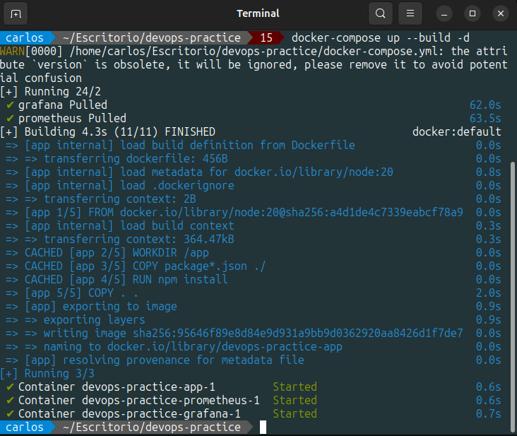

<h1>Actividad2-CC3S2</h1>
<h2>1. Lectura y análisis:</h2>

<b>- DevSecOps:</b> La integración de la seguridad en el ciclo de vida del desarrollador.

<b>- Infraestructura como código (IaC):</b> Automatización y gestión de infraestructura mediante código.

<b>- Observabilidad:</b> Un enfoque avanzado para monitorear y comprender el estao de los sistemas.

<b>- Experiencia de desarrollador:</b> Mejorar la satisfacción y productividad de los desarrolladores dentro de un equipo DevOps.

<b>- InnerSource:</b> La adopción de practicas de código abierto dentro de una organización.

<b>- Ingeniería de plataformas:</b> LA creación de plataformas internas para facilitar el desarrollo y la operación.

<h2>2. Preguntas de reflexión:</h2>

<b>- Pregunta 1: ¿Qué significa "desplazar a la izquierda" en el contexto de DevSecOps y por qué es importante?</b>

Desplazar a la izquierda significa que la seguridad debe ser proactiva y no reactiva, esto es tratar a la seguridad como un estado continuo y no como un punto final.

<b>- Pregunta 2: Explica cómo IaC mejora la consistencia y escalabilidad en la gestión de infraestructuras.</b>

<b>En consistencia:</b> Antes de la infraestructura como código las tareas como la configuración del servidor y la configuración de red se realizaban manualmente, esto con instrucciones procedimentales, este proceso al ser realizado manualmente tenia un alto riesgo de que se comentan errores y posibles inconsistencias entre los documentos procidimentales y el entorno real.

<b>En escalabilidad:</b> La metodologia como código se usa para gestionar y aprovisionar la infraestructura del sistema, incluidas las configuraciones de red y las configuraciones del servidor, a travez del código, estas caracteristicas son beneficiosas en sistemas a gran escala, dado que mediante se usan y aplican mediante herramientas de gestión de configuración por lo que permite su reproducibilidad y consistencia.

<b>- Pregunta 3: ¿Cuál es la diferencia entre monitoreo y observabilidad? ¿Por qué es crucial la observabilidad en sistemas complejos?</b>

<b>Diferencia entre monitoreo y observabilidad:</b> El monitoreo se basa en reglas que involucran métricas y puntos de referencia predeterminados; sin embargo, se limita a detectar dónde ocurre un problema, pero no explica por qué sucede. Por otro lado, la observabilidad ofrece un enfoque más completo que incluye el monitoreo y va más allá al proporcionar una visión integral de la salud general de un sistema. Busca una comprensión profunda de lo que ocurre en el sistema, basándose en métricas, registros y trazas, comúnmente conocidos como datos de telemetría. Además, proporciona un entorno de integración que ofrece una visión unificada del sistema a través de diversos entornos.

<b>- Pregunta 4: ¿Cómo puede la experiencia del desarrollador impactar el éxito de DevOps en una organización?</b>

Puede impactar de un manera positiva en la productivilidad si el desarrollador se desenvuelve en un ambiente feliz donde el flujo de trabajo sea constante y las fricciones de trabajo con otras areas sean minimas o no existan.

<b>- Pregunta 5: Describe cómo InnerSource puede ayudar a reducir silos dentro de una organización.</b>

InnerSource fomenta la comunicación abierta, el intercambio de codigo y la resolución colectiva de problemas en el paradigma de codigo abierto dentro de una organización permitiendo la colaboración entre equipos y el intercambio de conocimientos tecnicos creando asi una cultura más tarnsparente e inclusiva todo esto con el fin de eliminar los silos dentro de una organización y darle a los integrantes de la organización un sentido de propiedad.

<b>- Pregunta 6: ¿Qué rol juega la ingeniería de plataformas en mejorar la eficiencia y la experiencia del desarrollador?</b>

Tiene como objetivo implementar herramientas reutilizables y funciones de autoservicio, automatizar las operaciones de infraestructura y, por lo tanto, mejorar la experiencia y productividad del desarrollador.

<h2>Instrucciones:</h2>
<h3>1. Configuración del entorno</h3>

<b>1. Inicializa el proyecto de Node.js:</b>

En el escritorio crearemos la carpeta <b>devops-practice</b> en el cual inicializaremos el proyecto Node.js con <b>npm init -y.</b> 

<b>2. Instala las dependencias necesarias:</b>

Instalaremos el Framework Express para el manejo de peticiones HTTP y Jest es un paquete NPM para crear, ejecutar y estructurar pruebas.

<b>3. Crea la estructura del proyecto:</b>

Crearemos la carpeta <b>src y tests</b> en el cual crearemos los scripts vacios <b>app.js y app.test.js</b> respectivamente.

<b>4. Implementación de la API REST en src/app.js y src/server.js:</b>

El script <b>app.js</b> solo contendra laconfiguración de la aplicación y funcionara de la siguiente manera: Se importa el modulo Express para inicializar una nueva aplicación Express, esta aplicación se le asigna a la constante <b>app</b>. Se define la ruta GET en la raíz ('/'), cuando se acceda a esta ruta raíz esta nos dará la respuesta <b>Hello, World!</b>. Se exporta la aplicación <b>app</b> para que pueda ser utilizada por otros módulos.

Se creara el script <b>server.js</b> el cual tendra la logia del inicio del servidor asi como el puerto que sera utlizado para escuchar las solicitudes de los clientes.

<b>5. Escribe un test básico en test/app.test.js:</b>

El script app.test.js funcionara de la siguiente manera: Se importa la librería <b>supertest</b>, esta es una librería para realizar pruebas en aplicaciones web. Se importa <b>Express</b> desde <b>app.js</b>. Se hará uso de un servidor Express el cual se iniciara al ejecutar las pruebas y terminara al finalizar las pruebas, este servidor se ejecutara en un puerto dinámico, en <b>describe</b> se define el conjunto de pruebas para la ruta <b>'GET /'</b>. En <b>it</b> se define el test, el primer argumento de <b>it</b> es lo que debería hacer el código, el segundo argumento es la lógica de la prueba asincronía, <b>resquest(app).get('/')</b> usa <b>supertest</b> para hacer una solicitud <b>HTTP GET</b>  a la ruta <b>`/`</b>. Usamos <b>expect(res.statusCode).toEqual(200)</b> para verificar que la respuesta tenga un código de estado <b>200</b>, lo que indica que la solicitud fue exitosa seguidamente usamos <b>expect(res.text).toBe('Hello, World!')</b> para verificar que la aplicación responda correctamente a la solicitud del cliente.

<b>6. Configuración del script test en package.json:</b>

En <b>package.json</b> gestionaremos la configuración de nuestro proyecto, al cual se aginaremos en nombre de <b>devops-practice</b> con una version de <b>1.0.0</b>, también utilizaremos el script npm <b>jet</b>, como dependencia utilizaremos el framework <b>Express</b>, en <b>devDependencies</b> utilizaremos la version <b>27.0.0</b> de <b>jest</b> y la version <b>6.1.3</b> de <b>supertest</b>.

<h3>2. Implementación de DevSecOps</h3>

<b>- Integración de Seguridad</b>

<b>1. Configura una herramienta de análisis de seguridad estática como npm audit para encontar vulneravilidades en las dependencias.</b>

El comando <b>npm audit</b> realiza un examen exhaustivo del proyecto, identificando posibles vulnerabilidades de seguridad y generando un informe detalallado que resalta los problemas encontrados.

<b>2. Automatización del analisis de seguridad en GitHub Actions:</b>

El proceso descrito a continuación detalla cómo se configura y ejecuta un pipeline en un entorno de integración continua (CI). Este pipeline se activa cada vez que se realiza un push o pull request en la rama principal <b>main</b> del repositorio, lo que facilita la comunicación y sincronización entre los procesos de desarrollo.

El funcionamiento del pipeline se define en la sección <b>jobs</b>, donde se especifica el conjunto de pasos que se ejecutarán como parte del workflow. El primer job se denomina <b>build</b>, y en él utilizamos <b>runs-on</b> para definir el entorno de ejecución. En este caso, el workflow se ejecutará en una máquina virtual con la última versión disponible de Ubuntu, especificada como <b>ubuntu-latest</b>.

A continuación, en la sección <b>steps</b>, se detallan las acciones o comandos específicos que se ejecutarán dentro del job <b>build</b>. El primer paso es usar <b>actions/checkout@v2</b> para clonar el repositorio en la máquina virtual. El segundo paso, denominado "Set up Node.js", emplea la acción <b>actions/setup-node@v2</b> para instalar la versión 20 de Node.js en la máquina virtual.

El tercer paso, llamado "Install dependencies", ejecuta el comando <b>npm install</b> para instalar las dependencias necesarias, tal como se definen en <b>package.json</b>. El cuarto paso, "Run tests", utiliza el comando <b>npx jest --verbose</b> para ejecutar las pruebas unitarias y mostrar los resultados detalladamente.

El quinto paso, llamado "Run security audit", ejecuta el comando <b>npm audit</b> para generar un informe de todas las vulnerabilidades encontradas en las dependencias del proyecto.

<h3>3. Implementación de infraestructura como Código (IaC):</h3>

<b>- Usa Docker para contenerizar la aplicación:</b>

<b>1. Crea un archivo Dockerfile:</b>

En el archivo <b>Dockerfile</b>, comenzamos especificando la imagen base con FROM node:20, lo que indica que utilizaremos la imagen oficial de <b>Node.js</b> en su versión <b>20</b>. A continuación, establecemos el directorio de trabajo en el contenedor utilizando <b>WORKDIR /app</b>.

Luego, copiamos los archivos <b>package.json</b> y <b>package-lock.json</b> al contenedor con el comando <b>COPY package*.json ./ </b>. Para instalar las dependencias necesarias, ejecutamos <b>RUN npm install</b>.

Seguidamente, copiamos el resto de los archivos de la aplicación al contenedor con <b>COPY . .</b>. Posteriormente, exponemos el puerto en el que la aplicación se ejecutará utilizando <b>EXPOSE 3000</b>.

Finalmente, iniciamos la aplicación con el comando <b>CMD ["node", "src/app.js"]</b>.

<b>2. Construye y corre el contenedor:</b>

Utilizaremos el comando <b>docker build -t devops-practice .</b> para construir la imagen Docker. Una imagen docekr es una plantilla de solo lectura que define su contenedor, esta imagen contiene el código que se ejecutará, incluida cualquier definición para cualquier biblioteca  o dependencia que el codigo necesite. Un Contenedor de Docker es una imagen de Docker instanciada lo que significa que se esta ejecutando. Ejecutamos el comando <b> docker run -p 3000:3000 devops-practice para correr el contenedor Docker localmente en el puerto 3000 y se verifica que se esta ejecutando de manera correcta.</b>

<b>- Automatiza la gestión de contenedores usando Docker Compose:</b>

<b>1. Crea un archivo docker-compose.yml:</b>

Creamos el archivo <b>docker-compose.yml</b>, una herramienta de Docker que permite definir y gestionar aplicaciones compuestas por múltiples contenedores de manera declarativa. Este archivo especifica cómo se deben configurar y ejecutar los diferentes servicios de la aplicación, así como sus volúmenes, redes y otros parámetros.

En nuestro archivo <b>docker-compose.yml</b>, se construirá una imagen utilizando el Dockerfile en el directorio actual. Además, definimos cómo los puertos del contenedor se mapearán a los puertos del host, permitiendo la comunicación entre el contenedor y el exterior. También se establecen las variables de entorno que se pasarán al contenedor al momento de su ejecución, como la configuración de NODE_ENV en modo producción.

<b>2. Corre la aplicación usando Docker Compose:</b>

Utilizamos el comando <b>docker-compose up --build -d </b> para correr la aplicación utilizando Docker Compose.

<h3>4. Implementación de Observabilidad</h3>

<b>- Configura Prometheus y Grafana para monitorear la aplicación:</b>

<b>1. Crea un archivo prometheus.yml para configurar Prometheus:</b>

Prometheus es una aplicación que se utiliza para monitorear y alentar eventos, en nuestro código especificamos el tiempo en el que prometheus hará monitoreo de nuetra aplicación.

Para usar Prometheus se necesita el uso de un cliente para ello realizaremos la siguiente instalación:

<b>Actualización de app.js:</b>

Se actualiza <b>app.js</b> para el funcionamiento correcto de <b>Prometheus</b>, para el uso de Prometheus se necesita un cliente de prometheusm usamos <b>collectDefaultMetrics</b> para la recolección de metricas y espcificamos cada cuanto tiempo se hará esto. Para asegurarnos de que Prometheus pueda procesar correctamente los datos, se establece elt ipo de contenido de la respuesta como 'text/plain', en la siguiente solicitud de respuesta se obtiene el menssaje "Hello, World!". Finalmente utilizamos <b>module.exports</b> para que app.js pueda ser utilzado por otros archivos.

<b>2. Configura Grafana utilizando un docker-compose.yml actualizado:</b>

Grafana es un herramienta que se utiliza para anaizar y visualizar datos, permite crear cuadros de mando y graficos a partir de multiples fuentes.

<b>3. Ejecutamos docker-compose.yml:</b>

<h5>Exposición de resultados:</h5>

Visualización de la pagina Prometheus:

Conexión de Prometheus con Grafana para la visualización de metricas de nuestra aplicación:

Visualización de metricas en Grafana:

