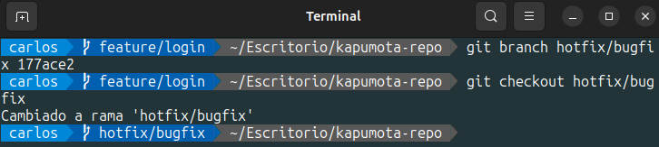
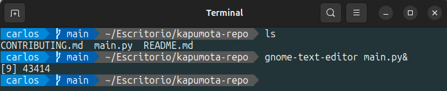
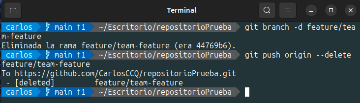

<h1>Actividad3-CC3S2</h1>
<h2>Actividad: Introducción a Git - conceptos básicos y operaciones esenciales</h2>
<h4>Conceptos básicos de Git: Comienza con una experiencia práctica</h4>
<p>Antes de profundizar en los detalles, comencemos con una experiencia práctica. Es probable que sea más facil comprender el concepto probándolo en lugar de solo leerlo al principio.</p>

<h5>git config: Preséntate a Git</h5>
<p>Ahora, hay algo que debes hacer antes de comenzar un proyecto. Presentate a Git. Para presentarte a Git, usa el comando git config:</p>

```shell
    $ git config --global user.name "CarlosCCQ"
    $ git config --global user.email "jhan.ccanto.q@uni.pe"
```
<p><b>git config</b> es un comando utilizado para configurar Git a nivel de sistema, usuario y repositorio. El nivel system se aplica a todos los usuarios y a todos los repositorios. El nivel global se aplica a todos los repositorios de un usuario especifico. El nivel local se aplica solo a un repositorio. </p>

<p>Para verificar que tu presentación se ha registrado, puedes comprobarlo con el comando <b>git config --list</b>:</p>

```shell
    $ git config --list
```


<h5>git init: Donde comienza tu viaje de código</h5>
<p>Al igual que cada gran viaje tiene su origen, en elmundo de Git, el viaje de tu código comienza con el comando <b>git init</b>. El comando se usa para inicializar un nuevo repositorio de Git y comenzar a rastrear directorios existentes. Cuando ejecutas el comando, configura un directorio <b>.git</b> lleno de todo lo necesario para el control de versiones. Con eso fuera del camino, estás listo para sumergirte en la gama de comandos de Git y menzar a rastrear y actualizar tu proyecto:</p>

```shell
    // Crea un directorio
    $ mkdir kapumota-repo
    
    // Cambia el directorio de trabajo actual
    $ cd kapumota-repo/
    $ git init
```


<p>Otra forma es pasar un nombre de directorio como argumento, como <b>git init kapumota-repo</b>; esto creará el directorio, por lo que no necesitas el comando <b>mkdir</b>.</p>

<p>Ahora que se ha creado el directorio <b>.git/</b>, los cambios en los archivos se guardan en el directorio <b>.git/</b>, pero Git no guarda automáticamente los archivos. En Git, guardar se completa ejecutando el comando <b>git add</b>, que selecciona conscientemente los archivos para guardar entre los que se han editado, agregando o eliminando, y el comando <b>git commit</b>, que registra esos cambios.</p>

<p>A continuación, agreguemos algo de código al repositorio.</p>

<h5>git add: Preparando tu código</h5>
<p>El comando <b>git add</b> es tu puente entre hacer cambios en tu directorio de trabajo y prepararlos para ser almacenados permanentemente en tu repositorio de Git. Cuando hacer cambios en tus archivos, Git reconoce que estos archivos han cambiado, pero estos cambios no están automáticamente listos para convertirse en parte del historial. Aquí es donde entra <b>git add</b>. Este es el proceso de guardar un documento de oficina, por así decirlo.</p>

<p>Primero, crea un nuevo archivo en tu directorio kapumota-repo:</p>

```shell
    // Crear un archivo README.md
    $ echo "README" > README.md
```


<p>El comando git status muestra el estado actual de tu repositorio, mostrando qué archivos tienen cambios que estan siendo rastrados y cuáles no. Cuando ves el mensaje "Untracked files", es la forma de Git de informarte que hay un archivo del que aún no se le ha dicho que esté pendiente. En nuestro ejemplo, el archivo README.md es nuevo para Git y no está registrado; por lo tanto, está etiquetado como no rastreado:</p>

```shell
    // Verificando cómo Git reconoce el nuevo archivo
    $ git status
    On branch main
    No commits yet
    Untracked files:
        (use "git add <file>..." to include in what will be committed)
        README.md
 ```


<p>Los archivos recién agregados son parte de tu proyecto, pero no han sido rastreados por Git. Para moverlos del estado no rastreado a un estado rastreado, usa el comando <b>git add</b>:</p>

```shell
    $ git add README.md
    $ git status
    On branch main
    No commits yet
    Changes to be committed:
        (use "git rm --cached <file>..." to unstage)
        new file: README.md
```


<p>Ahora Git reconoce <b>README.md</b> como un nuevo archivo y ahora está rastreado. El estado objetivo para guardar mediante el comando <b>git add</b> se llama staged (preparado). También puedes escuchar el término índice (index) utilizado indistintamente con staging. Antes de que los archivos o cambios sean preparados, residen en un área a menudo referida dcomo el espacio de trabajo (workspace). Esta es esencialmente el entorno donde estás haciendo cambios activamente en tus archivos.Algunos también pueden referirse a esta área como el arból de trabajo (worktree). En resumen, en este proceso, has preparado el archivo README.md desde elárbol de trabajo utilizando el comando <b>git add</b>.

Importante: git add tiene otras opciones también. Puedes incluir todo con git add ., incluir varios archivos como git add file1.md file2.md file3.md, o usar un comodín como <b>git add *.md</b> para agregar todos los archivos con extensión .md.

Todo está e su lugar; es hora de registrar tus modificaciones en el historial.</p>

<h5>git commit: registra cambios</h5>
<p>El comando <b>git commit</b> registra los cambios que has preparado con git add en el historial del repositorio. Esto te permite rastrear cambios a lo largo del tiempo.

Imagina que estás jugando un videojuego desafiante. A medida queavanzas, a menudo guardarás tu juego para bloquear tus logros. Del mismo modo, cuando desarrollas software, guardaras tu trabajo usndo git commit. Cada commit es un punto de guardao al que puedes regresar más tarde si es necesario.

Para cometer cambios, generalmente puedes hacer lo siguiente:</p>

```shell
    $ git commit -m "Initial commit with README.md"
```


<p>Aquí, la bandera -m es seguida por un mensaje corto y descriptivo que captura la esencia de los cambios que has hecho. Escribir buenos emnsajes de commit es un arte, ya que ayuda a entender el historial y la intención de los cambios.

Ahora, usemos el comando <b>git status</b> nuevamente para ver si todos los cambios en el directorio de trabajo actual has sido guardados:</p>

```shell
    $ git status
    On branch main
    nothing tocommit, working tree clean
```


<p>Si aparece el mensaje "nothing to commit", tus cambios han sido incorporados.

Bueno, eso es todo; es muy fácil guardar un archivo en Git. Revisémoslo aquí. El flujo de adición, preparación y commit sigue siendo el mismo sin importar cuám complejo sea tu proyecto:

1. Editar archivos: Realiza los cambios necesarios en tus archivos. Por ejemplo, en esta figura, se han editado dos archivos existentes para eliminaciones y modificaciones, y se ha agregado otro archivo:


2. Preparar cambios: Decide qué archivos o cambios especificos te gustaria cometer y prepárarlos. Por ejemplo, e esta figura, de las tres ediciones, solo las eliminaciones y modificaciones estan preparadas:


3. Commit de cambios: Una vez satisfecho con los cambios preparados, realiza un commit para registrarlos. Recuerda que cada commit genera un ID de commit única:


<h5>git log: Recorrer el aŕbol de commits</h5>

<p>Una vez que hayas realizado algunos commits,es posible que desees retroceder y ver el historial de cambios realizados en el repositorio. Aqui es donde el comando <b>git log</b> resulta útil. El comando muestra una lista de commits realizados es un repositorio en orden cronológio inverso, es decir, el commit más reciente se muestra primero.

Para probas esto, usa el siguiente comando:</p>

```shell
    $ git log
    commit a16e562c4cb1e4cc014220ec62f1182b3928935c(HEAD -> main)

    Author: CarlosCCQ <jhan.ccanto.q@uni.pe>
    Date: Thu Sep 28 16:30:00 2023 +0900
        Initial commit with README.md
```


<p>Esto mostrará una lista de todos los commits, cada uno con lo siguiente:</p>

- Identificador SHA-1 único: Actúa como una firma para el commit y puede emplearse en varios comandos de Git para referirse a ese commit especifico.
- Detalles de committer: Muestra el nombre y el correo electrónico de la persona que realizó el commit.
- Marca de tiempo (timestamp) del commit: Muestra cuándo se realizó el commit.
- Mensaje del commit: Una nota breve e informativa que captura la esencia de las modificaciones en el commit.

<p>Además del comando básico <b>git log</b>, hay numerosas opciones que te permiten adaptar la salida a tus necesidades:</p>

- git log -p: Muestra la diferencia (es decir, el parche) introducida en cada commit.
- git log --stat: Proporciona algunas estadísticas abreviadas para cada commit.
- git log --oneline: Da una salida más compacta, mostrando cad commit como una sola línea.
- git log ---graph: Visualiza la historia de branches y merges en un diseño de gráfico ASCII.
- git log --author="CarlosCCQ": Filtra los commits para mostrar solo los realizados por una persona específica (en este caso, "CarlosCCq").

<p>Por ejemplo, también puede mejorar la perspectiva de la siguiente manera:</p>

```shell
    $ git log --graph --pretty=format:'%x09 %h %ar ("%an")%s'
```

<p>Pregunta: ¿Cual es la salida de este comando?</p>
<p>Es un formato de salida el cual es una abreviación de la ID del commit con el tiempo en el que se desarrollo el ultimo commit seguidamente del usuario que realizo dicho commit junto con el commit registrado.</p>


<p>Pregunta: Intentemos el comando <b>git log</b> en este ejercicio (puedes realizar otra cosa como colocar las cosas en español). Primero, actualiza el archivo README.md y crea un nuevo archivo CONTRIBUTING.md:</p>

```shell
    $ echo "CONTRIBUTING" > CONTRIBUTING.md
    $ echo "README\n\nWelcome to the project" > README.md
    $ git add .
    $ git commit -m "Set up the repository base documentation"
```


<p>Una vez hecho, agrega un código de ejemplo en Python:<p>

```shell
    $ echo "print('Hello World')" > main.py
    $ git add .
    $ git commit -m "Add main.py"
```


<p>Cuando se confirme en el <b>log</b> que está correctamente registrado, está hecho:</p>

```shell
    $ git log --oneline
```


<p>En esencia, el comando <b>git log</b> es una herramienta vital para cualquier desarrollador. Te ayuda a navegar fácilmente a través delhistorial de tu código, ya que estés buscando un cambio especifico o simplemente revisando el trabajo anterior.</p>

<h4>Trabajar con branches: La piedra angular de la colaboración</h4>

<p>Mientras que las secciones anteriores te proporcionan una comprensión sólida de cómo inicializar y gestionar un repositoriode Git, el concepto de branching lleva esto aun nuevo nivel. Mientras que acumular <b>git commit</b> solo crea un historial lineal, <b> git branch</b> se puede  usar para crear un historial del entorno paralelo. Luego, puedes fusionar esos multiples entornos en uno, lo que permite que varias personas trabajen en ellos, dándote la flexibilidad para experimentar con nuevas caracteristicas, correciones de errores o incluso ideas totalmente vanguardistas sin afectar la base de tu código principal.</p>

<b>git branch: Entendiendo los conceptos básicos de Git branch</b>
<p>Cuando inicializas un repositorio de Git, automaticamente crea una branch predeterminada, generalmente llamada main (anteriormente conocida como master). Cuando ejecutas el comando <b>git branch</b>, mostrará la lista de todas las branches en tu repositorio, con la branch actual destacada:</p>

```shell
    $ git branch
    * main
```


<p>Es intuitivo pensar en un branch main lineal como en la siguiente figura:</p>


<p>Puedes crear una nueva branch con el comando <b>git branch < branch name ></b>. Este comando crea una nueva branch a partir de la branch actual:</p>

```shell
    $ git branch feature/new-feature
```


<p>Si creas una nueva branch, puedes construir una linea con un historial diferente y agregar commints a esa branch, como se muestra aquí:</p>


<p>Las convenciones de nombres de branches son importantes para la comunicación. Un estándar comúnmente utilizado es anteponer el nombre de la branch con feature/, bugfix/ o hotfix/, seguido de una breve descripción. Esto facilita que cualquiera entienda el propósito de la branch de un vistazo.

También puedes crear una branch a partir de una branch o commit especifico que sea diferente al que estás trabajando actualmente. Esto es particularmente útil cuando necesitas crear una branch de caracteristicas (feature) o correción de errores (bugfix) que deberia originarse desde una branch de desarrollo o staging designada en lugar de desde tu branch de trabajo actual:</p>

```shell
    // Crear un branch desde una branch especifica
    $ git branch <new-branch-name> <base-branch-name>
    // Crear branch desde un commit especifico
    $ git branch <new-branch-name> <commit-hash> 
```

<p>Se creara la rama feature1 en la rama feature/new-feature y tambien se creara la rama branch-feature a partir de un commit especifico de la rama main:</p>


<p>Visualización de git branch:</p>


<b>git checkout/git switch: Cambiar entre branches</b>

<p>En tu flujo de trabajo diario, a menudo necesitaras cambiar de una branch a otra, especialmente cuando trabajas en multiples caracteristicas o corrigiendo errores. Cuando hayas comenzado a trabajar en multiples branches, volverse consciente de la branch en la que estás activamente se vuelve fundamental. En Git, el término HEAD se refiere a la punta de la branch con la que estás trabajando activamente.

Cambiar de branch de trabajo actual se conoce como cambiar a una branch. El comando git checkout facilita esto:

Cambiar a la branch 'feature/new-feature'</p>

```shell
    $ git checkout feature/new-feature
```

<p>Esta operación cambia la posición de HEAD, la punta de la branch, a una branch llamada feature/new-feature:</p>


<p>El comando <b>git checkout</b> da como resultado dque la posición actual sea el commit en la punta de la branch feature/new-feature, es decir, HEAD.</p>

<b>Ejemplos adicionales:</b>

<h4>Crear una branch desde una branch especifica</h4>

```shell
    // verifica en qué rama estás actualmente
    $ git branch
```

<p>Creación de la rama <b>develop</b>:</p>


<p>Vizualización de las ramas existentes:<p>


```shell
    // Cambia a la rama 'develop' si no estás en ella
    $ git checkout develop
    // Crea una nueva 'feature/login' desde 'develop'
    $ git branch feature/login develop
```


```shell
    // Cambia a la nueva rama 'feature/login'
    $ git checkout feature/login
```


<p>Crear una branch desde un commit especifico</p>

```shell
    // Verificar el historial de commits para identificar el commit especifico 
    $ git log --oneline
```


```shell
    // Crear un nueva rama 'hotfix/bugfix' basada en el commit '177ace2'
    $ git branch hotfix/bugfix 177ace2
    // Cambiar a la nueva rama 'hotfix/bugfix'
    $ git checkout hotfix/bugfix
```



<p>Las versiones recientes de Git también ofrecen elcomando git switch, que proporciona una forma más intuitiva de cambiar branches:</p>

```shell
    // Cambiar a la branch 'feature/new-feature'
    $ git switch feature/new-feature
```


<p>A veces, puede resultar eficiente crear una nueva branch y cambiar a ella inmediatamente. Git proporciona un comando abreviado para esto, que combina la funcionalidad de git branch y git checkout o git switch.

Para crear una nueva branch y cambiar a ella en un solo paso, puedes usar el comando git checkout -b:</p>

```shell
    // Crear y cambiar a una nueva branch
    $ git checkout -b feature/nother-new-feature
```


<p>Essto es equivalente a ejecutar lo siguiente:</p>

```shell
    $ git branch feature/another-new-feature
    $ git checkout feature/another-new-feature
```

<p>En las versiones recientes de Git, puedes lograr lo mismo con git switch usando la opción -c:</p>

```shell
    $ git switch -c feature/another-new-feature
```

<b>git merge < Branch Name >: Fusionando branches</b>

<p>Una vez que hayas realizado cambios en un branch y los hayas probado a fondo, es posible que desees  integrar esos cambios nuevamente en la branch main u otra branch. Esta operación se conoce como merge (fusión):

Primero, cambia a la branch en la que deseas fusionar</p>

```shell
    $ git checkout main
```

<p>Ahora, fusionar tu branch de caracteristicas</p>

```shell
    $ git merge feature/new-feature
```


<p>La fusión te permite fusionar lineas con diferentes historias, como se muestra en la siguiente figura:</p>


<p>La fusión puede ser una operación sencilla, pero también puede complicarse si hay conflictos entre branches. En tales casos, Git requerirŕa intervención manual para resolver los conflictos. La resolución de conflictos en el proximo capítulo.</p>

<b>git branch -d: Eliminando una Branch</b>

<p>Una vez que una branch ha sido fusionada con éxito y ya no es necesaria, se puede eliminar para mantener limpio el repositorio:</p>

```shell
    // Eliminando una branch local
    $ git branch -d feature/new-feature
```


<h3>Preguntas:</h3>

* ¿Cómo te ha ayudado Git a mantener un historial claro y organizado de tus cambios?

Git mantienen un historial cronologico de los cambios y actualizaciones realizadas en el repositorio juntos con los commits que acompañan estos cambios, esto me ayuda a trabajar de manera organizada.

* ¿Qué beneficios ves en el uso de branches para desarrollar nuevas caracteristicas o corregir errores?

Cada error o caracteristica se trabajan de forma independiente y pueden ser asignados a distintos desarrolladores, esto ayuda a agilizar procesos y la distribución optima de las tareas de desarrollo.

* Realiza un revisión final del historial de commits para asegurarte de que todos los cambios se han registrado correctamente.

Para esto haremos uso de git log --oneline, prueba:


<h3>Ejercicios</h3>

#### Ejercicio 1: Manejo avanzado de branches y resolución de conflictos

Objetivo: Practicar la creación, fusión y eliminación de ramas, así como la resolución de conflictos que puedan surgir durante la fusión.

<b>Instrucciones:</b>

1. Crear una nueva rama para una caracteristica:
* Crea una nueva rama llamada feature/ advanced-feature desde la rama main:

```shell
    $ git branch feature/advanced-feature
    $ git checkout feature/advanced-feature
```


2. Modificar archivos en la nueva rama:
* Edita el archivo main.py para incluir una función adicional:

Usaremos el editor de texto de Ubuntu para modificar el archivo main.py y encluir la función:

```shell
    def greet():
        print('Hello from advanced feature')
    
    greet()
```

Para modificar el archivo main.py usaremos gnom-text-editor main.py&:


Seguidamente incluiremos la función en el archivo main.py:


* Añade y confirma estos cambios en la rama feature/advanced-feature:

```shell
    $ git add main.py
    $ git commit -m "Add greet function in advanced feature"
```


3. Simular un desarrollo paralelo en la rama main:
* Cambia de nuevo a la rama main:

```shell
    $ git checkout main
```


* Edita el archivo main.py de forma diferente (por ejemplo, cambia el mensaje del print original):

```shell
    print('Hello World - update in main')
```


* Añade y confirma estos cambios en la rama main:

```shell
    $ git add main.py
    $ git commit -m "Update main.py message in main branch"
```


4. Intenta fusionar la rama feature/advanced-feature en main:
* Fusiona la rama feature/advanced-feature en main:

```shell
    $ git merge feature/advanced-feature
```


5. Resolviendo el conflicto de fusión:
* Git generará un conflicto en main.py. Abre el archivo y resuelve el conflicto manualmente, eligiendo cómo combinar las dos versiones.

Visualización de conflictos de fusión de main con feature/advanced-feature:
Al editar el codigo main.py este nos proporciona los errores de fusión y la modificación que se realizo del archivo en cada rama.


Solución manual del conflicto:
Para solucionar los conflictos tenemos que editar el archivo main.py de tal manera que el archivo refleje las verdaderas intenciones del desarrollador.


Una vez realizado esta modificacion del archivo main.py podremos fusionar con exito la rama main y feature/advanced-feature, primero tenemos que guardar los cambios y seguidamente realizar un commit para guardar los cambios satisfactoriamente:

* Despues de resolver el conflicto, añade el archivo resuelto y completa la fusión:

```shell
    $ git add .
    $ git commit -m "Problemad de fusion de la rama main y feature/advanced-feature resuelto"
```


6. Eliminar la rama fusionada:

* Una vez que hayas fusionado con éxito y resuelto los conflictos, elimina la rama feature/advanced-feature:

```shell
    $ git branch -d feature/advanced-feature
```


#### Ejercicio 2: Exploración y manipulación del historial de commits

Objetivo: Aprender a navegar y manipular el historial de commits usando comandos avanzados de Git.

<b>Instrucciones:</b>

1. Ver el historial detallado de commits:
* Usa el comando git log para explorar el historial de commits, pero esta vez más detalle:

```shell
    $ git log -p
```

Resultado:

Se visualiza los commits realizados hasta el momento de forma detallada, junto con las moficaciones realizadas en cada uso del commit.


* Examina las diferencias introducidas en cada commit. ¿Qué camios fueron realizados en cada uno?

En el commit "Update main.py message in main branch" actualización del codigo main.py de print('Hello World') a print('Hello World - update in main'), en el siguiente commit realizo la fusión de las ramas y realizo el commit "Problemas de fusión de la rama main y feature/advanced-feature resueltas".

2. Filtra commits por autor:
* Usa el siguiente comando para mostrar solo los commits realizados por un autor especifico:

```shell
    $ git log --author="CarlosCCQ"
```

Resultado:
Se visualiza que el autor <b>CarlosCCQ</b> realizó 4 commits en la rama principal y no se puede visualizar los diferentes commits realizados en las demas ramas.


3. Revertir un commit:
* Imagina que el commit más reciente en main.py no deberia haberse hecho. Usa git revert para revertir ese commit:

```shell
    $ git revert HEAD
```


Debido a que el ultimo commit en la rama main es la fusión de la rama main con la rama feature/advanced-feature se debe especificar el commit de que rama se mantendra luego de la reversión del ultimo commit y como ahora no existe la rama feature/advanced-feature reestableceremos el ultimo commit de la rama principal (main), para eso usaremos el comando:

```shell
    $ git revert -m 1 <hash_commit>
```

donde '1' especifica la rama padre y para revertir el al ultimo commit realizado en esa rama utilizamos '-m 1' seguido del hash del ultimo commit realizado en aquella rama padre.

Resultado:


* Verifica que el commit de reversión ha sido añadido correctamente al historial.


Visualización de los commits realizados hasta el momento:
En la siguiente imagen, se puede observar que el commit ha sido revertido exitosamente.


4. Rebase interactivo:
* Realiza un rebase interactivo para combinar varios commits en uno solo. Esto es útil para limpiar el historial de commits antes de una fusión.
* Usa el siguiente comando para empezar el rebase interactivo:

```shell
    $ git rebase -i HEAD~3
```

Resultado:


* En el editor que se abre, combina los últimos tres commits en uno solo utilizando la opción squash.
Como se observa en la imagen anterior el comando <b>git rebase -i HEAD~3</b> abre un editor en la terminal donde antepone la palabra <b>pick</b> a los <b>hash</b> de los ultimos 3 commits realizados los cuales especificamos en <b>HEAD~3</b>, a continuación de esto nos proporciona opciones de comandos que podemos implementar a nuestros commits, como por ejemplo: dejar un commit intacto con <b>pick < commit ></b>, editar un commit con <b>edit < commit ></b>. Nosotros usaremos el commando <b>squash < commit  ></b> para unir los commits y tener un trabajo más limpio, esto se hará manteniendo <b>pick</b> en el commit donde se "unirán" los demas commits y reemplazaremos <b>pick</b> por la palabra <b>squash</b> en los commits que deseamos unir al commit que mantiene su <b>pick</b>.

##### Visualización:


Al guardar estos cambios tendremos el siguiente error:


Esto se debe a que algunos de los ultimos 3 commits se hicieron en la modificación de las mismas lineas del archivo main.py, esto se soluciona abriendo el archivo main.py y editandolo de tal manera que solo conservemos el código que queremos.

##### Visualizacion de conflicto en el archivo main.py:


##### Solucionando conflicto para el uso de squash:

Se modificara el archivo main.py para el correcto funcionamiento de <b>squash</b>.


Seguidamente guardaremos los cambios con <b>git add main.py</b> para que git pueda raastrear los cambios realizados en main.py.


Con las modificaciones ya realizadas continuaremos con el rebase usando el comando <b>git rebase --continue</b>.


Una vez hecho esto se nos abrira un editor en la terminal el cual deberemos editar y agregar un commit para que Git pueda rastrear el uso de squash. En el editor de texto que se abre en el terminal las lineas que inicien con <b>#</b> seran omitidas y la linea que no empiece con <b>#</b> sera asignado como el commit para los cambios realizados.
En este proceso usamos <b>#</b> en la linea del commit <b>Update main.py message in main branch</b> este commit permanecio sin <b>#</b> por no haber reemplazo su <b>pick</B> correspondiente con <b>squash</b>, el nuevo commit que le asignaremos será <b>Uso de squash para los ultimos 3 commits</b>.


Una vez guardado estos cambios tendremos el siguiente resultado en la terminal:


Con esto el uso del commando <b>git rebase -i HEAD~3</b> para la "unión" de los ultimos 3 commits quedo resuelto.

5. Visualización gráfica del historial:
* Usa el siguiente comando para ver una representación gráfica del historial de commits:

```shell
    $ git log --graph --oneline --all
```

Resultado:


* Reflexiona sobre cómo el historial de tu proyecto se visualiza en este formato. ¿Qué información adicional puedes inferir?

El uso de <b>squash</b> es un proceso destructivo y constructivo debido a que eliminó los <b>hash</b> de los commit que se "unierón" para crear un commit totalmente nuevo el cual no deja rastro del registro de moficiaciones que se hicieron y a los cuales se les hicieron comentarios (commits).


#### Ejercicio 3: Creación y gestión de branches desde commits especificos

Objetivo: Practicar la creación de ramas desde commits especificos y comprender cómo Git meneja las referencias históricas.

##### Instrucciones:

1. Crear un nueva rama desde un commit especifico:
* Usa el historial de commits (git log --oneline) para identificar un commit antiguo desde el cual crear una nueva rama:

```shell
    $ git log --oneline
```

Resultado:
Se puede observar que el commit más antiguo pertenece a la rama <b>hotfix/bugfix</b> el cual fue creado con el commit: <b>"Initial commit with README.md"</b>.


* Crea una nueva rama bugfix/rollback-feature desde ese commit:

```shell
    $ git branch bugfix/rollback-feature 177ace2
    $ git checkout bugfix/rollback-feature
```

Resultado:
Se procede a crear la rama <b>bugfix/rollback-feature</b> a partir del commit <b>177ace2</b>, luego nos ubicaremos en la nueva rama creada.


2. Modificar y confirmar cambios en la nueva rama:
* Realiza algunas modificaciones en main.py que simulen una corrección de errores:


Al no existir el archivo main.py en la nueva rama creada procederemos con la creación y edición del archivo main.py con el siguiente código:

```shell
    def greet():
        print('Fixed bug in feature')
```

Prueba:


* Añade y confirma los cambios en la nueva rama:

```shell
    $ git add main.py
    $ git commit -m "Fix bug in rollback feature"
```


3. Fusionar los cambios en la rama principal:
* Cambiar ne nuevo a la rama main y fusionar la rama bugfix/rollback-feature:

```shell
    $ git checkout main
    $ git merge bugfix/rollback-feature
```

Prueba:
Se observa que fallo la fusión de las ramas esto puede deberse a que el archivo main.py de la rama main y el archivo main.py de la rama bugfix/rollback-feature tienen codigos diferentes sobre las mismas lineas, esto se resolvera modificando manualmente el archivo main.py en la fusión.


Visualización del conflicto:


Para solucionar el conflicto expuesto tendremos que modificar manualmente el archivo main.py de la siguiente manera:


Se procedera con la fusión de los archivos main.py de las diferentes ramas, para esto usaremos git add main.py para registrar los cambios seguido de un git commit -m "Moficacion de main para una correcta fusíon" y seguidamente se procedera con la fusión utilizando el comando git merge bugfix/rollback-feature:

Prueba:


4. Explorar el historial después de la fusión:
* Usa git log y git log --graph para ver cómo se ha integrado el commit en el historial:

```shell
    $ git log --graph --oneline
```

Uso del comando git log:
Podemos visualizar los commits realizados en la rama main.


Uso del comando git log --graph --oneline:
Se puede observar las ramificaciones hechas en la rama principal main con sus respectivos commits.


5. Eliminar la rama bugfix/rollback-feature:
* Una vez fusianada los cambios, elimina la rama bugfix/rollback-feature:

```shell
    $ git branch -d bugfix/rollback-feature
```

Prueba:
La eliminación de algunas ramas es un recurso muy útil en el desarrollo de software. Una vez terminada el desarrollo de una parte del proyecto en alguna rama especifica y posteriormente fusionada con alguna otra rama esta podria eliminarse sin tener inconvenientes ni perder el progreso alcanzado en esa aquella rama.


#### Ejercicio 4: Manipulación y restauración de commits con git reset y git restore

Objetivo: Comprender cómo usar git reset y git restore para deshacer cambios en el historial y en el área de trabajo.

##### Intrucciones:

1. Hacer cambios en el archivo main.py:
* Edita el archivo main.py para introducir un nuevo cambio:

```shell
    print("This change will be reset")
```

Apertura del archivo main.py:
Usaremos gnome-text-editor main.py& para la apertura y edición del archivo main.py.

Prueba:



Se procedera con la edición del archivo main.py al cual se le añadira el código <b>"print('This change will be reset')"</b>:


* Añade y confirma los cambios:
Se preparán los cambios con git add main.py para ser incluidos en el commit "Introduce change to be reset".

```shell
    $ git add main.py
    $ git commit -m "Introduce change to be reset"
```

Prueba:


2. Usar git reset para deshacer el commit:
* Deshaz el commit utilizando git reset para volver al estado anterior:

```shell
    $ git reset --hard HEAD~1
```

Usamos git reset para modificar el historial de commits, --hard para reestablecer el área los cambios los cambios hacia el commit anterior y HEAD~1 para especificar en que commit cuantos commit hacia atras se va usar.


* Verifica que el commit ha sido eliminado del historial y que el archivo ha sido vuelto a su estado anterior.


Para visualizar el historial de commits utilizaremos el comando git log:
Se puede verificar que el commit "Introduce change to be reset" ya no forma parte del historia de commits.


A continuación se procedera a verificar el archivo main.py:
Se observa que se reesablecieron los cambios del archivo.py hacia el commit anterior que en este caso es "Modificación de main.py para una correcta fusión".


3. Usar git restore para deshacer cambios no confirmados:
* Realiza un cambio en README.md y no lo confirmes:

```shell
    $ echo "Another line in README">>README.md
    $ git status
```

Prueba:
En la siguiente imagen podemos apreciar que se modifico el archivo README.md y con el uso del comando de <b>git status</b> se verifica que este cambio no esta siendo registrado.


* Usa <b>git restore</b> para deshacer este cambio no confirmado:

```shell
    $ git restore README.md
```

Prueba:
Al hacer uso del comando git restore README.md Git ya no nos sugiere el uso de git add README.md debido que al hacer uso del comando git restore de deshacen los cambios realizados en el archivo README.md.


* Verifica que el cambio no confirmado ha sidoo revertido.

Prueba:
El archivo README.md no sufrio cambios y Git no nos advierte que debamos registrar algún cambio. Se uso el camando gnome-text-editor para visualizar el contenido de README.md


#### Ejercicio 5: Trabajo colaborativo y manejo de Pull Requests

Objetivo: Simular un flujo de trabajo colaborativo utilizando ramas y pull requests.

##### Instrucciones:

1. Crear un nuevo repositorio remoto:
* Usa GitHub o GitLab para crear un nuevo repositorio remoto y clónalo localmente:

```shell
    $ git clone https://github.com/CarlosCCQ/repositorioPrueba.git
```
Prueba:
Se clonó localmente el repositorio de prueba.


2. Crear una nueva rama para el desarrollo de una característica:
* En tu repositorio local,crea una nueva rama feaure/team-feature:

```shell
    $ git branch feature/team-feature
    $ git checkout feature/team-feature
```

Prueba:
Nos ubicaremos en el repositorio local clonado, luego crearemos la nueva rama llamada <b>feature/team-feature</b> con el comando <b>git branch feature/team-feature</b> seguidamente nos ubicaremos en la nueva rama creada con el comando <b>git checkout feature/team-feature</b>.


3. Realiza cambios y enviar la rama al repositorio remoto:
* Realiza cambios en los archivos del proyecto y confirmalos:

```shell
    $ echo "print('Collaboration is key!')">collaboration.py
    $ git add .
    $ git commit -m "Add collaboration script"
```

Prueba:
Al usar el comando ls podemos observar que no existe ningun archivo collaboration.py, este archivo seracreado a partir del terminal con el comando <b>echo "print('Collaboration is key')">collaboration.py</b>, seguidamente prepararemos los cambios realizados con el comando <b>git add .</b>, seguidamente registraremos los cambios con el comando <b>git commit -m</b> y el commit sera <b>"Add collaboration script"</b>


* Envia la rama al repositorio remoto:

Prueba:
El push se realizó correctamente.


4. Abrir un Pull Request:
* Abre un Pull Request (PR) en la plataforma remota (GitHub/GitLab) para fusionar feature/team-feature con la rama main:

Prueba:
En nuestro navegador de preferencia iremos a la ubicación de nuestro repositorio, en nuestro repositorio de GitHub nos deberia aparecer una nueva opción llamada <b>Compare & pull request</b> al cual le daremos click.


* Añade una descripción detallada de PR, explicando los cambios ralizados y su proposito.

Prueba:
Se añadio la descripción: <b>Se agrego el script collaboration.py que imprime el mensaje "collaboration is key"</b> seguidamente daremos click en la opción de Create pull request.


5. Revisar y Fusionar el Pull Request:
* Simula la revisión de código, comenta en el PR y realiza cualquier cambio necesario basado en la retroalimentación.

* Una vez aprobado, fusiona  el PR en la rama main.

Prueba:
La nueva rama no tiene conflictos con la rama principal main, el merge pull request se ejecutara sin problemas.


Una vez confirmado el Merge pull request, se podra eliminar la rama secundaria feature/team-feature debido a que los cambios realizados en esta rama ya han sido integradas a la rama principal main.


También se tienen que fusionar las ramas que se crearon localmente, antes de ahcer esto nos ubicaremos en la rama main con el comando <b>git checkout main</b> y seguidamente para fusionar las ramas localmente utilizaremos el comando <b>git merge feature/team-feature</b>.


6. Eliminar la rama remota y local:
* Después de la fusión, elimina la rama tanto local como remotamente:

```shell
    $ git branch -d feature/team-feature
    $ git push origin --delete feature/team-feature
```

Prueba:
Se elimino la rama feature/team-feature de la rama local con el comando <b>git branch -d feature/team-feature</b> y del repositorio remoto con el comando <b>git push origin --delete feature/team-feature</b>.



#### Ejercicio 6: Cherry-Picking y Git Stash

Objetivo: Aprender a aplicar commits especificos a otra rama utilizando git cherry-pick y guardar temporalmente cambios no confirmados utilizando git stash.

##### Instrucciones:

1. Hacer cambios en main.py y confirmarlos:
* Realiza y confirma varios cambios en main.py en la rama main:

```shell
    $ echo "print('Cherry pick this')">>main.py
    $ git add main.py
    $ git commit -m "Add cherry-pick example"
```

Prueba:
Se edita el arcivo main.py, lugo se preparan los cambios realizados en este archivo para despues ser registrado estos cambios con un commit.


2. Crear un nueva rama y aplicar el commit especifico:
* Crea una nueva rama feature/cherry-pick y aplícale el commit específico:

```shell
    $ git branch feature/cherry-pick
    $ git checkout feature/cherry-pick
    $ git cherry-pick <commit-hash>
```

Prueba:
Para usar los anteriores comandos necesitaremos el hash de un commit especifico, en este caso sera el del commit "Add cherry-pick example". Para saber los hash de los commits utilizaremos el comando <b>git log --oneline</b>.


Crearemos una nueva rama y utlizaremos este hash para aplicarle un commit especifico.

3. Guarda teamporalmente cambios no confirmados:
* Realiza algunos cambios en main.py pero no los confirmes:

```shell
    $ echo "This change is stashed">>main.py
    $ git status
```

Prueba:
Modificamos el archivo main.py y segidamente verificamos el estados del git, este nos sugiere realizar un git add main.py para posteriormente realizar un commit.


* Guarda temporalmente estos cambios utilizando git stash:

```shell
    $ git stash
```
Prueba:
La cantidad de cambios guardados teporalmente se encierran en <b>{ }</b> en este caso solo tenemos un cambio guardado temporalmente.


4. Aplicar los cambios guardados:
* Recupera los cambios guardados anteriormente:

```shell
    $ git stash pop
```

Prueba:
Al recuperar los cambios guardados anteriormente podremos realizar la preparación de los cambios con el comando <b>"git add main.py"</b> para luego realizar el registro de los cambios con el comando <b>"git commit -m "Mensaje""</b>.


5. Revisar el historial y confirmar la correcta aplicación de los cambios:
* Usa git log para revisar el historial de commits y verificar que todos los cambios se han aplicado correctamente.

Prueba:
Los cambios se realizarón satisfactoriamente.

